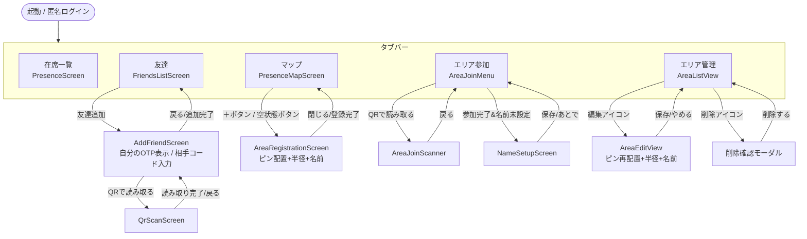

# Must完了時点 手動テストチェックリスト

2026-09-19時点。Must優先度のUser Story（US-018, 004, 001, 002, 005）に対応する
機能がひととおり実装・マージされた状態での、手動テスト用チェックリスト。

## 前提・既知の制約（テスト前に必ず確認）

- **認証**：匿名ログイン（`signInAnonymously`）。デモ用の暫定実装で、後日メール
  登録に移行予定（[ADR-0007](decisions/0007-auth-anonymous.md)、Issue #78）
- **同エリア内ユーザーの表示**：本来は`FRIEND_AREA_LINKS`の承認が無いと相手の
  名前は出ない設計だが、デモ用に「同じエリアにいれば無条件で名前・アイコンを
  表示する」よう緩和している（[ADR-0008](decisions/0008-demo-area-visibility-shortcut.md)、
  Issue #79）。**友達申請なしでも同エリアの相手が見える**のはこのため
- **友達追加（US-005）はバックエンド未接続**：`useFriendAddStore`は
  `app/mocks/otp.ts`のモックデータのみで完結しており、`friendships`/`otp_codes`
  テーブルには書き込まれない。**実機2台でお互いを友達追加しても、Supabase側には
  何も保存されない**（再起動でリセットされる）
- **デモ用エリアは1件固定**：エリア参加（QR/コード入力）は「神戸産業振興センター」
  （`50a37dc2-7e64-4da6-88a6-4aabfc57d2b1`、半径34m）に固定。コード:`KOBE2026`
- **ジオフェンス判定は実際の現在地に依存**：エリア内判定を確認するには、
  実機がそのエリアの半径内（またはモック位置情報）にいる必要がある

## 画面構成

タブバー（画面下部、6タブ・react-navigation未導入の簡易切り替え）：

| タブ | 画面 | 対応User Story |
|---|---|---|
| 在席一覧 | `PresenceScreen` | US-001, US-002 |
| 友達 | `FriendsScreen`（内部で一覧/追加/QR読取を切替） | US-005 |
| マップ | `PresenceMapScreen`（内部でモード切替） | US-001, US-004, US-018 |
| エリア参加 | `AreaJoinScreen`（内部でメニュー/QR読取/名前設定を切替） | US-018 |
| エリア管理 | `AreaManagementScreen`（内部で一覧/編集を切替） | US-018 |
| プロフィール | `ProfileScreen` | Issue #34（Must外・追加タスク） |

## 画面遷移



バックグラウンド動作（画面遷移とは独立）：`useGeofenceMonitor`フックが
ログイン完了後、常時（アプリがフォアグラウンドの間）位置情報を監視し、
エリア内外の判定・`presence_logs`への書き込みを行う（Issue #73で
タブ非依存化・Issue #81で在室中の位置更新にも対応）。

## チェック項目一覧

### US-018: エリア登録機能（地図ピン＋半径指定）

- [x] 「マップ」タブが空（参加エリア無し）の状態で「新規エリア登録」ボタンが出る
      （※未確認：既に参加エリアがあるため。`adb shell pm clear com.example.oruca`で
      アプリデータをクリアすると匿名ログインがリセットされ、未参加状態を再現できる）
- [x] マップをタップしてピンを配置できる
- [x] POI（施設アイコン）をタップしてもピンが配置される
- [x] ハンドルをドラッグして半径を変更できる（ピン移動では半径がリセットされない）
- [ ] エリア名を入力して登録すると、`areas`・`user_areas`にレコードが作られる
      （登録した本人は自動的にそのエリアの監視対象になる）
- [x] エリア名の上限（30文字）・空白のみ入力がガードされる
- [x] 「エリア管理」タブで、自分が作成したエリアの一覧が出る
- [x] エリア管理からエリア名・位置・半径を編集して保存できる
- [x] エリア管理からエリアを削除できる（確認モーダルが出る／削除後に一覧から消える）
- [x] 「エリア参加」タブでコード（`KOBE2026`）入力を使い、既存のデモエリアに
      参加できる（2026-09-19、testチャットで確認。既に参加済みの状態で再度
      実行すると`already_joined`扱いでトースト「すでに参加しています」が出る
      仕様も確認。※参加成功後、コード入力欄の状態はクリアされるが、Android側の
      表示が一瞬前の値のままに見えるケースがあった。実害は無さそうだが要観察）
- [ ] （環境依存・保留）QRコードのカメラ読み取りで参加できる：検証には別の
      カメラ付き端末が必要（現状エミュレーター1台のみのため未検証）。内部的には
      コード入力と同じ`joinArea()`を呼ぶだけなので、ロジック自体は上の項目で
      代替確認できる。カメラ権限・スキャン検知の動作のみ未検証として残る

### US-004: エリア外での位置情報非取得（ジオフェンス判定）

- [ ] 参加済みエリアの半径内に入ると、`presence_logs`に入室ログが作られる
- [ ] エリア内にいる間、`presence_logs.lat`/`lng`が現在地に追従して更新される
- [ ] エリア外に出ると、該当ログの`exited_at`が更新される（＝退室扱いになる）
- [ ] エリア外にいる間の位置情報は、どこにも保存されない（エリア判定の
      ローカル比較にのみ使われ破棄される）
- [ ] タブを「マップ」や「友達」に切り替えても、上記の監視が止まらない
      （バックグラウンドで継続する）

#### 調査メモ：エミュレーターでのジオフェンス再現手順（Issue #90、2026-09-19）

エミュレーター（Android、Google Playイメージ）で`adb emu geo fix`を使って
参加済みエリア内の座標を設定しても、`presence_logs`に入室ログが作られず
在席一覧・マップに反映されない、という報告に対する調査結果。

**確認できた事実（優先度順）**

1. **まず起動時クラッシュが起きていないか確認すること**：調査時点で、対象の
   エミュレーターにインストールされていたアプリは、起動直後に必ず
   `[runtime not ready]: Error: EXPO_PUBLIC_SUPABASE_URL / EXPO_PUBLIC_SUPABASE_ANON_KEY
   が設定されていません（.env.development参照）`でJSランタイムがクラッシュして
   いた（`adb logcat`で確認）。この状態だと`useGeofenceMonitor`のuseEffect自体が
   実行されないため、GPSの値が何であっても`presence_logs`は絶対に作られない。
   - `expo start`（Metro）の再起動、`adb shell pm clear`でのアプリデータ初期化
     だけでは直らなかった
   - `adb uninstall` → `npx expo run:android`でのクリーン再ビルド・再インストール
     で解消することを確認（ビルド自体はほぼ`UP-TO-DATE`で、JS側のみ更新された
     とみられる）。**根本原因（なぜ古いビルドがenv抜けの状態のまま固定されて
     いたか）は未特定**。運用上の対策としては、`.env.development`を編集した後は
     `expo start`の再起動だけでなく、**一度アプリをアンインストールしてから
     `npx expo run:android`でクリーン再インストールする**のが確実
   - この事象が再現するかどうかは、上記のエラーメッセージが`adb logcat`に
     出ていないかをまず確認すること（在席一覧が反映されない report を見たら
     最初に疑うべきポイント）
2. **`adb emu geo fix`自体が反映されないケースがある（要注意）**：上記の
   クラッシュとは別に、`adb shell dumpsys location`で`gps provider:`の
   `service`が`ProviderRequest[OFF]`（＝どのアプリもGPSプロバイダを能動的に
   要求していない）になっている場合、`geo fix`はコンソール上は`OK`を返すが
   実際には何にも反映されない（Fused Location Providerがそもそも新しい
   GPS取得を要求していないため）。
   - 再現手順：`adb shell dumpsys location`を実行し、`gps provider:`の`service`
     と`last location`のタイムスタンプ（`et=`、経過時間）を確認する。
     `ProviderRequest[OFF]`かつ`last location`が古いままなら、`geo fix`を
     何度実行しても無意味
   - 今回の調査では、アプリを強制終了→再起動しても`gps provider`が
     `ProviderRequest[OFF]`のまま変わらないケースを確認した。確実な回避策は
     今回の調査時間内には確立できなかった（Extended Controls（GUI）の
     Locationタブから明示的に地点をセットする方法、またはエミュレーターの
     設定でLocationモードを「device only（GPSのみ）」にする方法が候補として
     残っている。要追試）
3. コード側（`app/hooks/useGeofenceMonitor.ts`）自体に明確なバグは見つからな
   かった。ただし`watchPositionAsync`の`accuracy: Location.Accuracy.Balanced`
   （Android的にはblock-level、~100m精度）は、エリア半径の下限（10m、
   `docs/schema.md`参照）に対してかなり粗い可能性がある。これはエミュレーター
   固有の問題ではなく実機でも影響しうるため、**コード変更が必要かどうかは
   別途相談してから判断する**（ジオフェンス判定ロジックはCLAUDE.mdのガード
   レール対象）

**今後の運用ルール（2026-09-19、複数チャットからの申し送り）**：エミュレーター/
シミュレーターは共有リソースであり、各実装チャット（`code*`）からは起動・
操作しないこと。動作確認は`test`チャットに集約する。上記の調査は本チャットで
実施したが、これ以降の実機・エミュレーター検証は`test`チャット側に引き継ぐ。

#### 追加調査：JS側は「成功」を返すがOSレベルには未登録（Issue #90、2026-09-24）

上記2.の続き。`testチャット`に依頼し、`hooks/useGeofenceMonitor.ts`の
`watchPositionAsync`周りに一時的な診断ログを仕込んで再検証した結果、以下が
確定的に再現した。

- `watchPositionAsync`のPromiseは`granted` → `subscription obtained`まで
  正常に解決する（JS側は成功と認識する）
- しかし`adb shell dumpsys location`では、このアプリからのlocation provider
  リクエストが一切登録されていない（`gps provider`/`fused provider`とも
  `ProviderRequest[OFF]`のまま）
- そのため`watchPositionAsync`のコールバックは一度も呼ばれず、
  `adb emu geo fix`を打っても`presence_logs`は更新されない

**原因の見立て**：`expo-location`のAndroidネイティブ実装
（`node_modules/expo-location/android/.../LocationModule.kt`の
`requestLocationUpdates()`）は、`FusedLocationProviderClient.requestLocationUpdates()`
を呼んだ後、その戻り値（Google Play Servicesの非同期`Task`）の完了を
待たずに即座にJS側へ成功を返している（`SecurityException`だけを捕捉し、
他は無条件で`onRequestSuccess()`）。そのため、GMS側で実際の登録が
（何らかの理由で）失敗・スキップされていても、JSからは検知できない。
このエミュレーター固有でこれが起きている場合、Google Play Servicesの
状態（バージョン・破損の有無）が疑わしい。実機での再現有無は未確認。

**追試結果（`Accuracy.Balanced` → `Accuracy.High`）**：`testチャット`に依頼し、
`watchPositionAsync`の`accuracy`を`Location.Accuracy.Balanced`から
`Location.Accuracy.High`に変えてビルド・起動したところ、
`adb shell dumpsys location`で以下の通り**アプリのWorkSourceが実際に
登録され、5秒間隔（`timeInterval`設定通り）で継続的に位置が記録される**
ことを確認した。

```
gps provider:
  service: ProviderRequest[@+5s0ms, HIGH_ACCURACY, WorkSource{10226 com.example.oruca}]
  listeners:
    10155/com.google.android.gms[fused_location_provider]/... Request[@+5s0ms HIGH_ACCURACY, ...WorkSource{10226 com.example.oruca}]
```

なお、このエミュレーターのGoogle Play Servicesは`26.34.36`（比較的新しい
バージョン）だったため、GMSの古さ・破損が原因ではない。`Balanced`
（`PRIORITY_BALANCED_POWER_ACCURACY`、ネットワークプロバイダ優先）だと、
このエミュレーターでは登録そのものが（サイレントに）失敗し、`High`
（`PRIORITY_HIGH_ACCURACY`、GPS優先）だと成功する、という挙動差が
確定的に切り分けられた。

**現時点の結論**：これはoruca側のアプリコード自体のロジックバグではなく、
`expo-location`ライブラリの仕様（GMS Taskの完了を待たない実装）と、この
Androidエミュレーター環境における`Accuracy.Balanced`（ネットワークベースの
位置情報）の相性問題の組み合わせで起きている可能性が高い。`node_modules`
配下のライブラリコードは直接修正しない方針のため、対応候補を検討した：

1. 手動テストのデフォルト手順を`Accuracy.High`に変更する（テスト時だけ切替）
2. AVDを新しいシステムイメージで作り直す（今回のGMSバージョン自体は新しい
   ため、優先度は低い）
3. 手動テストは実機（Android実機）で行う運用に切り替える
4. `useGeofenceMonitor.ts`側で、一定時間`watchPositionAsync`のコールバックが
   一度も呼ばれない場合にリトライ・警告表示する等のフォールバックを追加する

**決定（2026-09-26）**：本番コードも`Location.Accuracy.High`に統一する
（1番を本番コードにも適用する形で採用）。フォールバック（4番）は見送り。
`hooks/useGeofenceMonitor.ts`の`watchPositionAsync`を`Accuracy.High`に変更
済み（Issue #90対応PR）。バッテリー消費は`Balanced`より増えるが、ジオフェンス
判定が機能しないことの方が影響が大きいため、この時点ではトレードオフを
許容する判断とした。

### US-001: リアルタイム在席人数表示

- [ ] 「在席一覧」タブに、参加中エリアの名前と在席人数が表示される
      （2026-09-19、testチャットで部分確認：エリア名「神戸産業振興センター」は
      表示される。ただし在席0人の場合は数値ではなく「在席中の人はいません」
      という文言表示になっており、人数が数値として出るケースは未確認。
      仕様として妥当かは開発者判断待ち）
- [ ] 自分がエリアに入室すると、他の端末（別セッション）の在席人数がリアルタイムで
      増える（Supabase Realtime購読）
- [ ] 自分が退室すると、人数がリアルタイムで減る
- [ ] アプリを開き直した（当日中の再確認）時も、その時点の正しい人数が表示される

### US-002: 友達・グループメンバーの在席確認

- [ ] 「在席一覧」タブの友達リストに、同エリアにいる相手が名前・アイコン付きで
      表示される（※現状はADR-0008により友達申請なしでも表示される点に注意）
- [ ] エリアにいない相手は「不在」表示になる
- [ ] 「マップ」タブで、同エリアの相手のアイコンが地図上の現在地に表示される

### US-005: OTPによる友達追加（なりすまし防止）

- [x] 「友達」タブで自分のOTP（QRコード＋6桁コード）が表示される
- [x] OTPは60秒で失効し、自動的に新しいコードに切り替わる
- [ ] 相手のコードを入力する、またはQRを読み取ることで友達に追加できる
- [ ] 期限切れ・自分自身・存在しないコードそれぞれで適切なエラーメッセージが出る
- [ ] ※バックエンド未接続のため、この結果はSupabaseの`friendships`には
      反映されない（既知の制約、上記参照）

### プロフィールアイコン設定（Issue #34、Must外の追加タスク）

- [x] 「プロフィール」タブで現在の名前・アイコンが表示される
- [x] 画像を選択してアップロードすると、アイコンが即座に反映される
      （Issue #88で修正済み。PR #89マージ後に再確認しOK）
- [ ] 設定したアイコンが、在席一覧・マップ・友達一覧など他画面にも反映される
- [x] 再アップロードすると、古い画像が新しい画像に上書きされる（同じパスに保存）

## 備考

GitHub上の親issue（#1 US-018, #2 US-004, #3 US-001, #5 US-002）は、上記の
実装がすべて個別issue・PR経由でマージ済みの状態でもまだOPENのままになっている。
上のチェックリストで問題が無ければ、まとめてクローズしてよいか確認すること。
