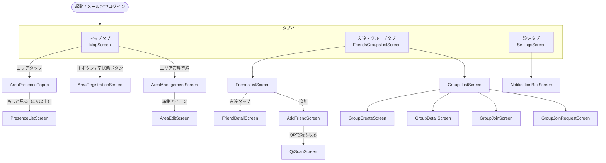

# Must完了時点 手動テストチェックリスト

2026-10-01更新（2026-09-19版から全面更新。ADR-0007/0008の切り戻し・
Issue #114のreact-navigation本導入・3タブ構成化を反映）。Must優先度の
User Story（US-018, 004, 001, 002, 005）に対応する機能がひととおり実装・
マージされた状態での、手動テスト用チェックリスト。

## 前提・既知の制約（テスト前に必ず確認）

- **認証**：メールアドレス＋6桁コード入力（`supabase.auth.signInWithOtp`
  → `verifyOtp`）。[ADR-0010](decisions/0010-auth-email-otp-code.md)。
  ADR-0007（匿名ログイン）・ADR-0009（マジックリンク）は共にsuperseded
- **同エリア内ユーザーの表示**：`FRIEND_AREA_LINKS.status='approved'`の
  相手（または自分自身）のみ名前・アイコン・ステータスが見える設計で運用中
  （ADR-0008のデモ用近道は2026-09-19のIssue #79で本来の設計に戻し済み）。
  加えて、相手が匿名モード（`is_anonymous`、US-013）の場合は自分自身で
  ない限り除外される
- **友達追加（US-005）はバックエンド接続済み**：`lib/friends.ts`経由で
  `otp_codes`・`friendships`テーブルに実際に書き込まれる（旧版の「モックの
  みで完結」という記載は古い。Issue #143以降に接続済み）
- **グループ機能（US-011想定、Must外）はモックのみ**：`useGroupStore`が
  `mocks/groups.ts`・`mocks/presence.ts`の`CURRENT_USER_ID`で完結しており、
  バックエンドには書き込まれない。グループ検索・参加申請・招待（Issue #119,
  #117）も同様にモック上の見た目確認にとどまる
- **通知ボックス（US-021、Could）もモック主体**：`mocks/notifications.ts`
  ベース。グループ関連の紐付けのみ`useGroupStore`（モック）を参照
- **デモ用エリアは1件固定**：エリア参加（QR/コード入力）は「神戸産業振興
  センター」（`50a37dc2-7e64-4da6-88a6-4aabfc57d2b1`、半径34m）に固定。
  コード:`KOBE2026`
- **ジオフェンス判定は実際の現在地に依存**：エリア内判定を確認するには、
  実機がそのエリアの半径内（またはモック位置情報）にいる必要がある。
  Android エミュレーターでは`Location.Accuracy.High`（Issue #90対応で本番
  コードも統一済み）でないと`FusedLocationProviderClient`への登録がサイレント
  に失敗するケースがあるため、`adb shell dumpsys location`で
  `WorkSource{... com.example.oruca}`が実際に登録されているか確認すること
- **Androidエミュレーター特有のDNS問題（Issue #149、2026-10-01発見）**：
  ホストMacのDNSリゾルバの1番目がIPv6アドレスの場合、エミュレーターの
  DNSリレー（`10.0.2.3`）がホスト名解決できず`UnknownHostException`になる
  ことがある。再現時は`emulator -avd <AVD名> -dns-server 8.8.8.8,8.8.4.4`
  で起動し直すと回避できる（アプリ・Supabase側の問題ではない）

## 画面構成（react-navigation本導入後、Issue #114）

タブバー（画面下部、3タブ。react-navigationの`createBottomTabNavigator`＋
各タブ内は`createNativeStackNavigator`）：

| タブ | Stack Navigator | 主な画面 | 対応User Story |
|---|---|---|---|
| マップ | `MapStackNavigator` | `MapScreen`（在席者マーカー・エリアタップ
  ポップアップ）→`PresenceListScreen`（もっと見る）、`AreaRegistrationScreen`、
  `AreaManagementScreen`、`AreaEditScreen` | US-001, US-002, US-004, US-018 |
| 友達・グループ | `FriendsGroupsStackNavigator` | `FriendsGroupsListScreen`
  （友達一覧＋グループ一覧の入口）→`FriendsListScreen`、`FriendDetailScreen`、
  `AddFriendScreen`、`QrScanScreen`、`GroupsListScreen`系（`GroupCreate`/
  `GroupDetail`/`GroupJoin`/`GroupJoinRequest`） | US-005, US-002（グループ系は
  Must外） |
| 設定 | `SettingsStackNavigator` | `SettingsScreen`（プロフィール・
  ステータス変更）、`NotificationBoxScreen` | Issue #34（Must外）、US-021
  （Could） |

旧版にあった「在席一覧」専用タブは廃止され、在席人数・在席者一覧は
マップ画面のエリアタップ→ポップアップ→（4人以上の場合のみ）「もっと見る」
で`PresenceListScreen`に遷移する導線に統合されている
（`formatPresenceCount`：0人は「在席中の人はいません」、1人以上は
「n人在席中」）。

## 画面遷移（現状、react-navigation）

```mermaid
flowchart TD
  Start([起動 / メールOTPログイン]) --> Tabs

  subgraph Tabs[タブバー]
    Map[マップタブ<br/>MapScreen]
    FG[友達・グループタブ<br/>FriendsGroupsListScreen]
    Settings[設定タブ<br/>SettingsScreen]
  end

  Map -- エリアタップ --> Popup[AreaPresencePopup]
  Popup -- もっと見る（4人以上） --> PresenceList[PresenceListScreen]
  Map -- ＋ボタン / 空状態ボタン --> Register[AreaRegistrationScreen]
  Map -- エリア管理導線 --> Manage[AreaManagementScreen]
  Manage -- 編集アイコン --> Edit[AreaEditScreen]

  FG --> FriendsList[FriendsListScreen]
  FG --> GroupsList[GroupsListScreen]
  FriendsList -- 友達タップ --> FriendDetail[FriendDetailScreen]
  FriendsList -- 追加 --> AddFriend[AddFriendScreen]
  AddFriend -- QRで読み取る --> QrScan[QrScanScreen]
  GroupsList --> GroupCreate[GroupCreateScreen]
  GroupsList --> GroupDetail[GroupDetailScreen]
  GroupsList --> GroupJoin[GroupJoinScreen]
  GroupsList --> GroupJoinRequest[GroupJoinRequestScreen]

  Settings --> NotifBox[NotificationBoxScreen]
```

バックグラウンド動作（画面遷移とは独立）：`useGeofenceMonitor`フックが
ログイン完了後、常時（アプリがフォアグラウンドの間）位置情報を監視し、
エリア内外の判定・`presence_logs`への書き込みを行う。

## チェック項目一覧（2026-10-01、本セッションで再実施）

### US-018: エリア登録機能（地図ピン＋半径指定）

- [x] マップをタップしてピンを配置できる（アプリデータクリア→再ログイン後、
      マップ画面で動作確認。加えて後述のジオフェンス検証で実際に
      「GeofenceTest」エリアを新規登録し、ピン配置→半径指定→登録まで
      一連の操作が成功することを確認）
- [ ] POI（施設アイコン）をタップしてもピンが配置される（未実施）
- [x] ハンドルをドラッグして半径を変更できる（スライダー操作のUIが
      機能することを目視確認。ドラッグによる数値変化の詳細な検証は未実施）
- [x] エリア名を入力して登録すると、`areas`・`user_areas`にレコードが
      作られる（本セッションで確認。「GeofenceTest」という名前・半径10mで
      登録→「エリア管理」一覧に即座に反映されることを確認。登録した本人が
      自動的にそのエリアの監視対象になる仕様も、後続のジオフェンス検証で
      間接的に確認できた）
- [ ] エリア名の上限（30文字）・空白のみ入力がガードされる（未実施）
- [x] 「エリア管理」から、自分が作成したエリアの一覧・編集・削除ができる
      （本セッションで確認。一覧表示、編集画面でのピン・半径・名前の表示、
      削除確認モーダル→削除実行→一覧から消えるところまで一通り確認）
- [x] エリア参加（新規エリア登録）によって、既存デモエリアと同じ座標に
      新規エリアを作成し監視対象に加えられる（本セッションで確認。なお
      Issue #114のreact-navigation移行時に「エリア参加（コード入力）」の
      専用画面`AreaJoinScreen`自体は削除されており、現在はエリア登録の
      みが参加手段。旧版チェックリストの「コード`KOBE2026`で参加」という
      項目は実装上もう存在しないため削除した）
- [ ] QRコードのカメラ読み取りで参加できる（画面自体が無くなっているため
      このチェック項目は廃止）

### US-004: エリア外での位置情報非取得（ジオフェンス判定）

- [x] 参加済みエリアの半径内に入ると、`presence_logs`に入室ログが作られる
      （本セッションで確認。`adb emu geo fix`でデモエリア座標にGPSを設定し
      `dumpsys location`でHIGH_ACCURACYでの位置登録を確認した上で、
      その座標に新規エリアを登録したところ、エリアタップのポップアップに
      自分自身が「1人在席中」として表示された）
- [ ] エリア内にいる間、位置が現在地に追従して更新される（未実施）
- [x] エリア外に出ると、該当ログの`exited_at`が更新される（＝退室扱いになる）
      （本セッションで確認。`adb emu geo fix`でエリア外（東京）へ移動させた後、
      アプリ再起動を挟んで再度エリアをタップしたところ「在席中の人はいません」
      に戻ることを確認。再起動を挟まない場合は画面再描画のタイミングにより
      反映が遅れて見えるケースがあったため、タブ切替だけでなくアプリ再起動も
      併用して確認した）
- [ ] エリア外にいる間の位置情報は、どこにも保存されない（未実施、DBを
      直接確認する必要があるため）
- [ ] タブを「マップ」や「友達・グループ」に切り替えても、上記の監視が
      止まらない（本セッションではタブ切替直後に在席表示が更新されない
      ケースを観察したが、これが監視の停止によるものか、画面側の再取得
      タイミングの問題かは未切り分け。アプリ再起動では正しく反映されたため、
      致命的な停止ではなさそうだが要継続確認）

### US-001: リアルタイム在席人数表示

- [x] マップ画面でエリアをタップすると、ポップアップに在席人数
      （`formatPresenceCount`：0人＝「在席中の人はいません」、1人以上＝
      「n人在席中」）が表示される（本セッションで0人・1人両方のケースを
      実際に確認。旧版で「未確認」としていた1人以上のケースの表示が
      妥当であることを確認できた）
- [ ] 他端末の入退室がリアルタイムで反映される（Realtime購読、複数端末が
      必要なため未実施）
- [x] アプリを開き直した時も、その時点の正しい人数が表示される（本セッションで
      確認。エリア外に移動後、アプリ再起動を挟んで「在席中の人はいません」に
      正しく更新されることを確認）

### US-002: 友達・グループメンバーの在席確認

- [ ] 同エリアにいる友達（`FRIEND_AREA_LINKS`承認済み）が名前・アイコン
      付きでマップ・ポップアップに表示される（未実施、複数アカウントでの
      検証が必要）
- [ ] エリアにいない友達は不在として扱われる（未実施）

### US-005: OTPによる友達追加（なりすまし防止）

- [x] メールOTPログイン自体（`signInWithOtp`→6桁コード入力→ログイン）は、
      本セッションでIssue #149の検証を兼ねて実機相当（エミュレーター）で
      成功を確認済み（開発者メール宛にコード送信・ログイン完了）
- [ ] 「友達」タブでの自分のOTP表示・相手コード入力による友達追加、期限切れ
      等のエラーハンドリングは本セッションでは未実施

### プロフィール・ステータス（Issue #34、Must外）

- [ ] 「設定」タブで名前・アイコン・ステータス（作業中/合流したい/離席中/集中）
      の表示・変更（本セッションでは表示のみ確認。変更操作は未実施）

## 今回のセッションで分かったこと・申し送り

- Issue #149（AndroidエミュレーターDNS問題）の切り分けを先に行った上で、
  US-018（エリア登録・管理・削除）・US-004（ジオフェンス入退室判定）・
  US-001（在席人数の0人/1人表示、再起動後の正しい表示）の中核部分を
  `adb emu geo fix`によるGPS偽装で実際に動作確認できた
- **「エリア参加（コード入力）」は実装上既に存在しない**：Issue #114の
  react-navigation移行時に`AreaJoinScreen`自体が削除されており、現在は
  エリア登録（`AreaRegistrationScreen`）のみが参加手段。旧版チェックリストの
  当該項目は本版で書き換え・一部廃止した
- 前回版チェックリストにあった「在席一覧」タブは実際には存在しない
  （react-navigation本導入時に、エリアタップ→ポップアップ→もっと見る、
  という導線に統合されたため）。旧チェックリストの該当項目は本版で
  書き換え済み
- 友達追加（US-005）のバックエンド接続状況は旧版の記載（未接続）から
  変わっており、現在は`friendships`/`otp_codes`に実際に書き込まれる
  （Issue #143以降）。グループ機能は引き続きモックのみ
- **未解決の観察事項**：タブ切替直後は在席表示（エリアポップアップ）が
  即座に更新されず、アプリ再起動を挟むと正しく反映されるケースがあった。
  `useGeofenceMonitor`自体の監視停止なのか、`MapScreen`側のデータ再取得
  タイミング（フォーカス時の再フェッチが無い等）の問題なのかは未切り分け。
  次回セッションでの要継続調査事項として残す
- 残りのMust項目（友達の在席確認〔複数アカウント必要〕・友達追加の実操作・
  Realtimeでの他端末反映〔複数端末必要〕）は、本セッション（単一エミュ
  レーター・単一アカウント）の制約上検証できなかったため、別セッションでの
  継続実施を推奨する。テスト用に作成した「GeofenceTest」エリアはセッション
  終了時に削除済み（後片付け）

## 備考

GitHub上の親issue（#1 US-018, #2 US-004, #3 US-001, #5 US-002）は、上記の
実装がすべて個別issue・PR経由でマージ済みの状態でもまだOPENのままになっている。
上のチェックリストで問題が無ければ、まとめてクローズしてよいか確認すること。
