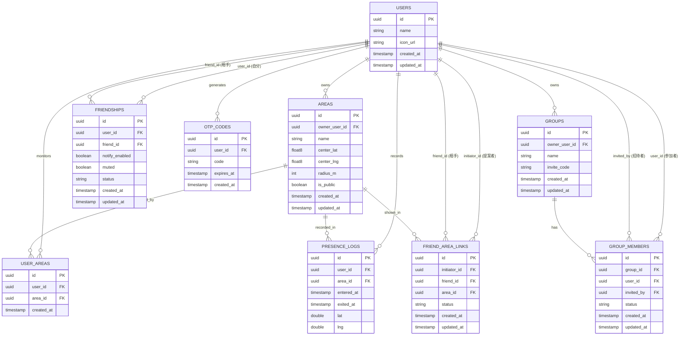

# DB設計（Must User Story対応・正式版）

以下が本開発（`app/`）で使用する正式なスキーマ。

## ER図

## 各テーブルの役割

- **USERS**：利用者本体。`icon_url`はSupabase Storageの`avatars`バケット
  （公開読み取り・本人のフォルダのみ書き込み可、Issue #34）に保存した画像の
  公開URL。パスは`{user_id}/icon.<拡張子>`とし、再アップロード時は上書きする
  （一般的なサービスのアバターと同様、閲覧側の制限は設けない方針）
- **AREAS**：US-018で登録するエリア（円形：中心座標＋半径）。`center_lat`/
  `center_lng`は小数点以下6桁に丸める（約11cm精度、地図SDKの生の値をそのまま
  保存しない）。`radius_m`は10〜200mの範囲（下限はGPS精度によるブレを考慮、
  上限はオフィス・部室規模を想定。学校のような広い敷地は複数エリアに分けて
  登録する前提。値は最も近い整数に丸める）
- **USER_AREAS**：個人が「このエリアを監視する」ための登録。承認不要
- **FRIENDSHIPS**：友達関係。片方向（user_id→friend_id）で1関係につき2行。
  `notify_enabled`（US-007）・`muted`（US-008）を関係ごとに個別管理できる
- **FRIEND_AREA_LINKS**：特定の友達との間で「このエリアでは名前つきで
  見せ合う」という合意。提案（pending）→承認（approved）の二段階
- **OTP_CODES**：US-005のワンタイムパスワード（60秒で失効）
- **GROUPS**：US-006・US-010のグループ本体。`owner_user_id`が唯一の管理者
  （複数管理者は未対応、今後必要になれば別途検討）。`invite_code`は招待コードを
  知っていれば誰でも参加申請できる仕組み（Issue #65のエリア参加の仕組みに準拠）
- **GROUP_MEMBERS**：グループへの参加申請・メンバーシップ。`status`は
  pending（申請中）→approved（承認済み）／rejected（却下）の二段階。
  `invited_by`は既存メンバーが友達を直接招待した場合の招待者（招待コードでの
  自己申請の場合はnull）。グループ内での名前公開は`status = 'approved'`で
  あることのみを条件とする（グループとエリアの紐づけ・エリア単位の合意形成は
  別Issueで検討）
- **PRESENCE_LOGS**：入退室記録。`exited_at`がnullの間は在席中を意味する。
  `lat`/`lng`はエリア内にいる間の現在地（2026-08-17、開発者の希望でエリア内の
  正確な位置を友達に共有する方針に決定）。更新頻度（リアルタイム更新か否か）・
  精度・退室後の削除ポリシーは未決定（別途検討）

## 設計上の重要な原則

1. 「個人がエリアを使う（USER_AREAS）」と「友達に名前を見せる
   （FRIEND_AREA_LINKS）」は必ず分離する。混同するとプライバシー事故の
   原因になる
2. 名前表示のロジックは、必ず `FRIEND_AREA_LINKS.status = 'approved'`
   をチェックしてから行うこと。`PRESENCE_LOGS`だけを見て名前を出す実装は
   禁止（エリア同士が重なっている場合に、紐づいていない相手の名前が
   誤って見えてしまう）
3. 物理削除が必須なのは**アカウント退会時**。退会時は位置情報・友達関係など
   機微データを含め、すべて物理削除する（PRDのプライバシー方針に基づく）。
   一方、友達解除・グループ退会のような通常操作（アカウント自体は残る）は、
   ソフトデリート（`status`列の変更など）で構わない
4. グループ機能（US-006など）は`GROUPS`・`GROUP_MEMBERS`を新規テーブルとして
   追加し、既存テーブルは変更しない方針とする（2026-09-19、開発者確認済み）。
   グループとエリアの紐づけ（「グループがどのエリアで在席を共有するか」）は
   US-006のスコープ外とし、別Issueで設計する
