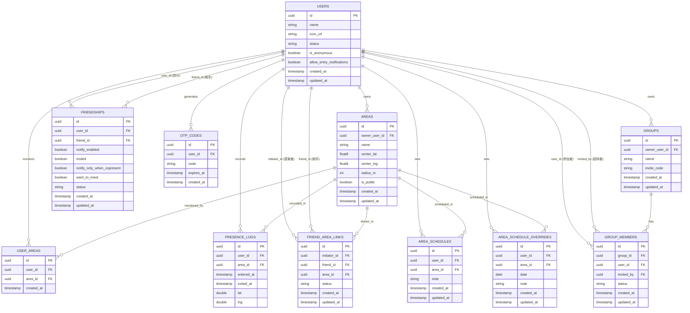

# DB設計（Must User Story対応・正式版）

以下が本開発（`app/`）で使用する正式なスキーマ。

## ER図

## 各テーブルの役割

- **USERS**：利用者本体。`icon_url`はSupabase Storageの`avatars`バケット
  （公開読み取り・本人のフォルダのみ書き込み可、Issue #34）に保存した画像の
  公開URL。パスは`{user_id}/icon.<拡張子>`とし、再アップロード時は上書きする
  （一般的なサービスのアバターと同様、閲覧側の制限は設けない方針）。
  `status`はUS-014（ステータス表示機能、Issue #10）用の任意項目で、
  `working`（作業中）／`want_to_join`（合流したい）／`away`（離席中）／
  `focus`（集中）のいずれか、またはnull（未設定）。名前・アイコンと同じ
  可視性ルール（`FRIEND_AREA_LINKS.status = 'approved'`の相手にのみ公開）が
  RLSポリシー上そのまま適用される（USERSの行全体に対するポリシーのため）。
  `is_anonymous`はUS-013（一時的な匿名モード、Issue #13）用のフラグ。
  エリア単位ではなくアカウント全体で1つのON/OFF（2026-09-22、開発者確認済み）。
  `true`の間は`FRIEND_AREA_LINKS`の承認状態に関わらず、友達に対して名前だけで
  なく在席（`PRESENCE_LOGS`由来のisPresent）も非表示にする。デフォルトは
  `false`。`allow_entry_notifications`はUS-017（会いたい人の入室通知、
  Issue #15）専用のグローバル許可（アカウント全体で1つ、2026-09-24、
  開発者確認済み）。「自分の入室を、自分を`FRIENDSHIPS.want_to_meet`で
  登録している相手に通知してよいか」。デフォルト`true`（オプトアウト方式、
  `notify_enabled`と同じ）。既存の友達ごとの`notify_enabled`（US-007/016）
  とは別物で、通常の入室通知には影響しない
- **AREAS**：US-018で登録するエリア（円形：中心座標＋半径）。`center_lat`/
  `center_lng`は小数点以下6桁に丸める（約11cm精度、地図SDKの生の値をそのまま
  保存しない）。`radius_m`は10〜200mの範囲（下限はGPS精度によるブレを考慮、
  上限はオフィス・部室規模を想定。学校のような広い敷地は複数エリアに分けて
  登録する前提。値は最も近い整数に丸める）
- **USER_AREAS**：個人が「このエリアを監視する」ための登録。承認不要
- **FRIENDSHIPS**：友達関係。片方向（user_id→friend_id）で1関係につき2行。
  `notify_enabled`（US-007）・`muted`（US-008）・`notify_only_when_copresent`
  （US-016、Issue #14。デフォルトfalse。trueの間は、自分がその友達の入室先
  エリアに在席している時だけ入室通知を受け取る。`muted`と同様、受信側が
  自分の行に設定する値）・`want_to_meet`（US-017、Issue #15。デフォルト
  false。trueの間は、`notify_only_when_copresent`の制限を上書きし、共在
  していなくても入室通知を受け取る。ただし相手（friend_id）の
  `USERS.allow_entry_notifications`がfalseなら通知しない。優先度は
  `muted`（最優先）→`want_to_meet`（共在制限を上書き）の順。`muted`と同様、
  受信側が自分の行に設定する値）を関係ごとに個別管理できる。実際の通知
  イベント自体の記録・既読管理は別Issueで検討する（2026-09-23、開発者確認済み）
- **FRIEND_AREA_LINKS**：特定の友達との間で「このエリアでは名前つきで
  見せ合う」という合意。提案（pending）→承認（approved）の二段階
- **OTP_CODES**：US-005のワンタイムパスワード（60秒で失効）
- **GROUPS**：US-006・US-010のグループ本体。`owner_user_id`が唯一の管理者
  （複数管理者は未対応、今後必要になれば別途検討）。`invite_code`は招待コードを
  知っていれば誰でも参加申請できる仕組み（Issue #65のエリア参加の仕組みに準拠）
- **GROUP_MEMBERS**：グループへの参加申請・メンバーシップ。`status`は
  pending（申請中）→approved（承認済み）／rejected（却下）の二段階。
  `invited_by`は既存メンバーが友達を直接招待した場合の招待者（招待コードでの
  自己申請の場合はnull）。グループ内での名前公開は`status = 'approved'`で
  あることのみを条件とする（グループとエリアの紐づけ・エリア単位の合意形成は
  別Issueで検討）
- **AREA_SCHEDULES**：US-011の基本滞在予定。ユーザー×エリアごとに1件
  （`unique(user_id, area_id)`）。時刻・曜日は構造化せず`note`に自由記述で
  登録する（2026-09-19、開発者確認済み。詳細な構造化は今後の検討課題）
- **AREA_SCHEDULE_OVERRIDES**：US-011の当日上書き予定。ユーザー×エリア×
  日付ごとに1件（`unique(user_id, area_id, date)`）。`AREA_SCHEDULES`と同様
  `note`は自由記述。友達への公開条件は名前表示と同じく
  `FRIEND_AREA_LINKS.status = 'approved'`（原則2参照）
- **PRESENCE_LOGS**：入退室記録。`exited_at`がnullの間は在席中を意味する。
  `lat`/`lng`はエリア内にいる間の現在地（2026-08-17、開発者の希望でエリア内の
  正確な位置を友達に共有する方針に決定）。更新頻度（リアルタイム更新か否か）・
  精度・退室後の削除ポリシーは未決定（別途検討）

## 設計上の重要な原則

1. 「個人がエリアを使う（USER_AREAS）」と「友達に名前を見せる
   （FRIEND_AREA_LINKS）」は必ず分離する。混同するとプライバシー事故の
   原因になる
2. 名前表示のロジックは、必ず `FRIEND_AREA_LINKS.status = 'approved'`
   をチェックしてから行うこと。`PRESENCE_LOGS`だけを見て名前を出す実装は
   禁止（エリア同士が重なっている場合に、紐づいていない相手の名前が
   誤って見えてしまう）
3. 物理削除が必須なのは**アカウント退会時**。退会時は位置情報・友達関係など
   機微データを含め、すべて物理削除する（PRDのプライバシー方針に基づく）。
   一方、友達解除・グループ退会のような通常操作（アカウント自体は残る）は、
   ソフトデリート（`status`列の変更など）で構わない
4. グループ機能（US-006など）は`GROUPS`・`GROUP_MEMBERS`を新規テーブルとして
   追加し、既存テーブルは変更しない方針とする（2026-09-19、開発者確認済み）。
   グループとエリアの紐づけ（「グループがどのエリアで在席を共有するか」）は
   US-006のスコープ外とし、別Issueで設計する
