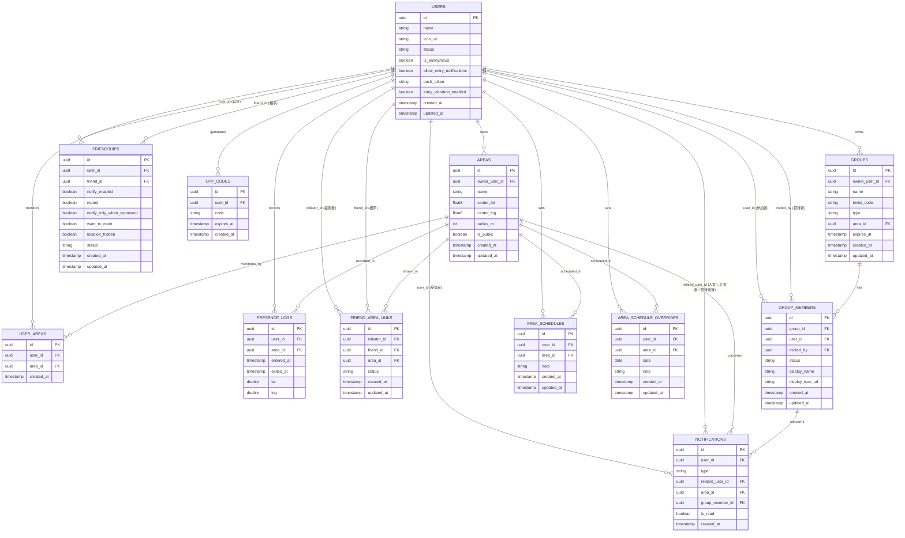

# DB設計（Must User Story対応・正式版）

以下が本開発（`app/`）で使用する正式なスキーマ。

## ER図

```mermaid
erDiagram
  USERS ||--o{ AREAS : owns
  USERS ||--o{ USER_AREAS : monitors
  AREAS ||--o{ USER_AREAS : monitored_by
  USERS ||--o{ PRESENCE_LOGS : records
  AREAS ||--o{ PRESENCE_LOGS : recorded_in
  USERS ||--o{ FRIENDSHIPS : "user_id (自分)"
  USERS ||--o{ FRIENDSHIPS : "friend_id (相手)"
  USERS ||--o{ FRIEND_AREA_LINKS : "initiator_id (提案者)"
  USERS ||--o{ FRIEND_AREA_LINKS : "friend_id (相手)"
  AREAS ||--o{ FRIEND_AREA_LINKS : shown_in
  USERS ||--o{ OTP_CODES : generates
  USERS ||--o{ GROUPS : owns
  USERS ||--o{ GROUP_MEMBERS : "user_id (参加者)"
  USERS ||--o{ GROUP_MEMBERS : "invited_by (招待者)"
  GROUPS ||--o{ GROUP_MEMBERS : has
  USERS ||--o{ AREA_SCHEDULES : sets
  AREAS ||--o{ AREA_SCHEDULES : scheduled_in
  USERS ||--o{ AREA_SCHEDULE_OVERRIDES : sets
  AREAS ||--o{ AREA_SCHEDULE_OVERRIDES : scheduled_in
  USERS ||--o{ NOTIFICATIONS : "user_id (受信者)"
  USERS ||--o{ NOTIFICATIONS : "related_user_id (入室した友達・招待者等)"
  AREAS ||--o{ NOTIFICATIONS : concerns
  GROUP_MEMBERS ||--o{ NOTIFICATIONS : concerns

  USERS {
    uuid id PK
    string name
    string icon_url
    string status
    boolean is_anonymous
    boolean allow_entry_notifications
    string push_token
    boolean entry_vibration_enabled
    timestamp created_at
    timestamp updated_at
  }
  AREAS {
    uuid id PK
    uuid owner_user_id FK
    string name
    float8 center_lat
    float8 center_lng
    int radius_m
    boolean is_public
    timestamp created_at
    timestamp updated_at
  }
  USER_AREAS {
    uuid id PK
    uuid user_id FK
    uuid area_id FK
    timestamp created_at
  }
  FRIENDSHIPS {
    uuid id PK
    uuid user_id FK
    uuid friend_id FK
    boolean notify_enabled
    boolean muted
    boolean notify_only_when_copresent
    boolean want_to_meet
    boolean location_hidden
    string status
    timestamp created_at
    timestamp updated_at
  }
  FRIEND_AREA_LINKS {
    uuid id PK
    uuid initiator_id FK
    uuid friend_id FK
    uuid area_id FK
    string status
    timestamp created_at
    timestamp updated_at
  }
  OTP_CODES {
    uuid id PK
    uuid user_id FK
    string code
    timestamp expires_at
    timestamp created_at
  }
  GROUPS {
    uuid id PK
    uuid owner_user_id FK
    string name
    string invite_code
    string type
    uuid area_id FK
    timestamp expires_at
    timestamp created_at
    timestamp updated_at
  }
  GROUP_MEMBERS {
    uuid id PK
    uuid group_id FK
    uuid user_id FK
    uuid invited_by FK
    string status
    string display_name
    string display_icon_url
    timestamp created_at
    timestamp updated_at
  }
  AREA_SCHEDULES {
    uuid id PK
    uuid user_id FK
    uuid area_id FK
    string note
    timestamp created_at
    timestamp updated_at
  }
  AREA_SCHEDULE_OVERRIDES {
    uuid id PK
    uuid user_id FK
    uuid area_id FK
    date date
    string note
    timestamp created_at
    timestamp updated_at
  }
  PRESENCE_LOGS {
    uuid id PK
    uuid user_id FK
    uuid area_id FK
    timestamp entered_at
    timestamp exited_at
    double lat
    double lng
  }
  NOTIFICATIONS {
    uuid id PK
    uuid user_id FK
    string type
    uuid related_user_id FK
    uuid area_id FK
    uuid group_member_id FK
    boolean is_read
    timestamp created_at
  }
```

## 各テーブルの役割

- **USERS**：利用者本体。`icon_url`はSupabase Storageの`avatars`バケット
  （公開読み取り・本人のフォルダのみ書き込み可、Issue #34）に保存した画像の
  公開URL。パスは`{user_id}/icon.<拡張子>`とし、再アップロード時は上書きする
  （一般的なサービスのアバターと同様、閲覧側の制限は設けない方針）。
  `status`はUS-014（ステータス表示機能、Issue #10）用の任意項目で、
  `working`（作業中）／`want_to_join`（合流したい）／`away`（離席中）／
  `focus`（集中）のいずれか、またはnull（未設定）。名前・アイコンと同じ
  可視性ルール（`FRIEND_AREA_LINKS.status = 'approved'`の相手にのみ公開）が
  RLSポリシー上そのまま適用される（USERSの行全体に対するポリシーのため）。
  `is_anonymous`はUS-013（一時的な匿名モード、Issue #13）用のフラグ。
  エリア単位ではなくアカウント全体で1つのON/OFF（2026-09-22、開発者確認済み）。
  `true`の間は`FRIEND_AREA_LINKS`の承認状態に関わらず、友達に対して名前だけで
  なく在席（`PRESENCE_LOGS`由来のisPresent）も非表示にする。デフォルトは
  `false`。`allow_entry_notifications`はUS-017（会いたい人の入室通知、
  Issue #15）専用のグローバル許可（アカウント全体で1つ、2026-09-24、
  開発者確認済み）。「自分の入室を、自分を`FRIENDSHIPS.want_to_meet`で
  登録している相手に通知してよいか」。デフォルト`true`（オプトアウト方式、
  `notify_enabled`と同じ）。既存の友達ごとの`notify_enabled`（US-007/016）
  とは別物で、通常の入室通知には影響しない。
  `push_token`はIssue #131（プッシュ通知の実配信基盤）用。`expo-notifications`の
  `getExpoPushTokenAsync()`で取得したExpoPushToken文字列を、ログイン中の端末で
  最後に取得した1件だけ保存する（複数端末対応は将来課題）。本人のみ更新可能
  （既存RLSポリシーでカバー）。送信側のEdge Functionはservice roleで読み取る。
  `entry_vibration_enabled`はIssue #169（入室通知の振動ON/OFF）用。
  アカウント全体で1つのグローバル設定（`allow_entry_notifications`と同じ
  持ち方）。デフォルト`true`。`send-entry-notifications` Edge Functionが
  受信者ごとにこの値を見て、Expo Pushメッセージの`sound`（iOS）・
  `channelId`（Android、事前にクライアント側で作成した振動あり/なしの
  通知チャンネルを指定）を切り替える
- **AREAS**：US-018で登録するエリア（円形：中心座標＋半径）。`center_lat`/
  `center_lng`は小数点以下6桁に丸める（約11cm精度、地図SDKの生の値をそのまま
  保存しない）。`radius_m`は10〜200mの範囲（下限はGPS精度によるブレを考慮、
  上限はオフィス・部室規模を想定。学校のような広い敷地は複数エリアに分けて
  登録する前提。値は最も近い整数に丸める）
- **USER_AREAS**：個人が「このエリアを監視する」ための登録。承認不要
- **FRIENDSHIPS**：友達関係。片方向（user_id→friend_id）で1関係につき2行。
  `notify_enabled`（US-007）・`muted`（US-008）・`notify_only_when_copresent`
  （US-016、Issue #14。デフォルトfalse。trueの間は、自分がその友達の入室先
  エリアに在席している時だけ入室通知を受け取る。`muted`と同様、受信側が
  自分の行に設定する値）・`want_to_meet`（US-017、Issue #15。デフォルト
  false。trueの間は、`notify_only_when_copresent`の制限を上書きし、共在
  していなくても入室通知を受け取る。ただし相手（friend_id）の
  `USERS.allow_entry_notifications`がfalseなら通知しない。優先度は
  `muted`（最優先）→`want_to_meet`（共在制限を上書き）の順。`muted`と同様、
  受信側が自分の行に設定する値）・`location_hidden`（Issue #121。一方向
  ブロック。デフォルトfalse。自分の行でtrueにすると、相手（friend_id）は
  自分の`presence_logs`を閲覧できなくなる。他の3列と違い「情報を隠す側」が
  自分の行に設定する点に注意。友達関係自体は残る（`status`は変更しない）。
  クライアント側フィルタではなくDBレベルで強制するため、`presence_logs`の
  SELECTポリシーにブロック確認を組み込む、2026-09-29、開発者確認済み）を
  関係ごとに個別管理できる。実際の通知イベント自体の記録・既読管理は
  別Issueで検討する（2026-09-23、開発者確認済み）
- **FRIEND_AREA_LINKS**：特定の友達との間で「このエリアでは名前つきで
  見せ合う」という合意。提案（pending）→承認（approved）の二段階
- **OTP_CODES**：US-005のワンタイムパスワード（60秒で失効）
- **GROUPS**：US-006・US-010のグループ本体。`owner_user_id`が唯一の管理者
  （複数管理者は未対応、今後必要になれば別途検討）。グループへの参加経路は
  `type`に応じて2通りに統一されている（`closed`＝招待のみ、`open`＝招待
  コード/QRのみ）。グループを検索して参加申請する機能（旧`is_public`列、
  Issue #119）は、open/closedの種別が整理された結果、現在の設計と矛盾する
  ため廃止した（closedは元々関わりのある人同士が対象で見知らぬ相手の検索
  参加には馴染まず、openは招待コードさえあれば承認不要で即参加できることが
  前提のため、検索して承認待ちで申請するルートとは両立しない。Issue #202、
  2026-10-02開発者確認済み）
- **GROUPS.type/area_id/expires_at**：Issue #148（2026-10-01開発者確認済み）。
  `type`は`'closed'`（友達同士・サークルなど、メンバーが固定された従来通りの
  招待制）と`'open'`（イベントなど、`invite_code`をQR等で読み込むだけで承認不要・
  即座に参加できるグループ）の2種類。`'open'`では`area_id`（イベント会場）が
  必須、`'closed'`では`area_id`はnull（DB側CHECK制約で強制）。`expires_at`は
  `'open'`作成時に`created_at + 7日`を自動セットし、期限が過ぎたオープン
  グループは自動削除する（手動削除機能は不要）。削除自体はpg_cron（毎時）が
  `delete_expired_open_groups()`を実行して行う（Issue #183、2026-10-01
  AI実装・開発者確認済み）。`'closed'`は`expires_at`も
  null（無期限）
- **GROUP_MEMBERS**：グループへの参加申請・メンバーシップ。`status`は
  pending（申請中）→approved（承認済み）／rejected（却下）の二段階。
  `invited_by`は既存メンバーが友達を直接招待した場合の招待者（招待コードでの
  自己申請の場合はnull）。グループ内での名前公開は`status = 'approved'`で
  あることのみを条件とする（グループとエリアの紐づけ・エリア単位の合意形成は
  別Issueで検討）。ただし`type = 'open'`のグループでの在席状況の公開は、
  RLSではなくクエリ側フィルタとして、自分がその`GROUPS.area_id`に
  現在在籍中（`PRESENCE_LOGS.exited_at IS NULL`）の場合のみ見える
  （Issue #148、2026-10-01開発者確認済み）。`display_name`/`display_icon_url`は
  そのグループ内限定で`USERS.name`/`icon_url`を上書きする任意項目。未設定時は
  `USERS`側にフォールバックする（Issue #150、本名・普段のアイコンを知らない
  相手が多いオープングループ向け）
- **AREA_SCHEDULES**：US-011の基本滞在予定。ユーザー×エリアごとに1件
  （`unique(user_id, area_id)`）。時刻・曜日は構造化せず`note`に自由記述で
  登録する（2026-09-19、開発者確認済み。詳細な構造化は今後の検討課題）
- **AREA_SCHEDULE_OVERRIDES**：US-011の当日上書き予定。ユーザー×エリア×
  日付ごとに1件（`unique(user_id, area_id, date)`）。`AREA_SCHEDULES`と同様
  `note`は自由記述。友達への公開条件は名前表示と同じく
  `FRIEND_AREA_LINKS.status = 'approved'`（原則2参照）
- **PRESENCE_LOGS**：入退室記録。`exited_at`がnullの間は在席中を意味する。
  `lat`/`lng`はエリア内にいる間の現在地（2026-08-17、開発者の希望でエリア内の
  正確な位置を友達に共有する方針に決定）。更新頻度（リアルタイム更新か否か）・
  精度・退室後の削除ポリシーは未決定（別途検討）
- **NOTIFICATIONS**：通知イベントの記録・既読管理（Issue #126、2026-09-30、
  開発者確認済み）。`type`は`entry`（US-007/016の通常入室通知）・
  `want_to_meet`（US-017の会いたい人通知）・`arrival_summary`（US-021の
  会える人一覧、Issue #16）・`group_invite`（グループへの招待、Issue #117）の
  いずれか。`related_user_id`・`area_id`・`group_member_id`は`type`に応じて
  使う列だけを埋め、他はnullにする（他テーブルと同じ明示列スタイルを踏襲し、
  jsonb等の汎用payload列は使わない方針）。`arrival_summary`は「1入室イベントで
  同時に会える人が複数いる」場合、会える人1人につき1行作る（＝同じarea_id・
  同じcreated_atの行が複数できる）。表示側（通知ボックス）でarea_id×
  created_atが一致する行をグループ化し、1枚のカードにまとめる。既読管理は
  シンプルな`is_read`真偽値のみとし、既読日時は持たない

## 設計上の重要な原則

1. 「個人がエリアを使う（USER_AREAS）」と「友達に名前を見せる
   （FRIEND_AREA_LINKS）」は必ず分離する。混同するとプライバシー事故の
   原因になる
2. 名前表示のロジックは、必ず `FRIEND_AREA_LINKS.status = 'approved'`
   をチェックしてから行うこと。`PRESENCE_LOGS`だけを見て名前を出す実装は
   禁止（エリア同士が重なっている場合に、紐づいていない相手の名前が
   誤って見えてしまう）
3. 物理削除が必須なのは**アカウント退会時**。退会時は位置情報・友達関係など
   機微データを含め、すべて物理削除する（PRDのプライバシー方針に基づく）。
   一方、友達解除・グループ退会のような通常操作（アカウント自体は残る）は、
   ソフトデリート（`status`列の変更など）で構わない
4. グループ機能（US-006など）は`GROUPS`・`GROUP_MEMBERS`を新規テーブルとして
   追加し、既存テーブルは変更しない方針とする（2026-09-19、開発者確認済み）。
   グループとエリアの紐づけ（「グループがどのエリアで在席を共有するか」）は
   US-006のスコープ外とし、別Issueで設計する
