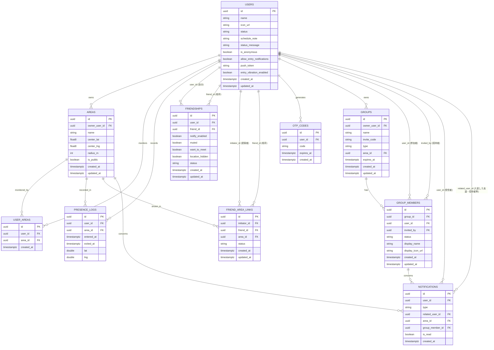

# DB設計（Must User Story対応・正式版）

以下が本開発（`app/`）で使用する正式なスキーマ。

## ER図

```mermaid
erDiagram
  USERS ||--o{ AREAS : owns
  USERS ||--o{ USER_AREAS : monitors
  AREAS ||--o{ USER_AREAS : monitored_by
  USERS ||--o{ PRESENCE_LOGS : records
  AREAS ||--o{ PRESENCE_LOGS : recorded_in
  USERS ||--o{ FRIENDSHIPS : "user_id (自分)"
  USERS ||--o{ FRIENDSHIPS : "friend_id (相手)"
  USERS ||--o{ FRIEND_AREA_LINKS : "initiator_id (提案者)"
  USERS ||--o{ FRIEND_AREA_LINKS : "friend_id (相手)"
  AREAS ||--o{ FRIEND_AREA_LINKS : shown_in
  USERS ||--o{ OTP_CODES : generates
  USERS ||--o{ GROUPS : owns
  USERS ||--o{ GROUP_MEMBERS : "user_id (参加者)"
  USERS ||--o{ GROUP_MEMBERS : "invited_by (招待者)"
  GROUPS ||--o{ GROUP_MEMBERS : has
  USERS ||--o{ NOTIFICATIONS : "user_id (受信者)"
  USERS ||--o{ NOTIFICATIONS : "related_user_id (入室した友達・招待者等)"
  AREAS ||--o{ NOTIFICATIONS : concerns
  GROUP_MEMBERS ||--o{ NOTIFICATIONS : concerns

  USERS {
    uuid id PK
    string name
    string icon_url
    string status
    string schedule_note
    string status_message
    boolean is_anonymous
    boolean allow_entry_notifications
    string push_token
    boolean entry_vibration_enabled
    timestamptz created_at
    timestamptz updated_at
  }
  AREAS {
    uuid id PK
    uuid owner_user_id FK
    string name
    float8 center_lat
    float8 center_lng
    int radius_m
    boolean is_public
    timestamptz created_at
    timestamptz updated_at
  }
  USER_AREAS {
    uuid id PK
    uuid user_id FK
    uuid area_id FK
    timestamptz created_at
  }
  FRIENDSHIPS {
    uuid id PK
    uuid user_id FK
    uuid friend_id FK
    boolean notify_enabled
    boolean muted
    boolean want_to_meet
    boolean location_hidden
    string status
    timestamptz created_at
    timestamptz updated_at
  }
  FRIEND_AREA_LINKS {
    uuid id PK
    uuid initiator_id FK
    uuid friend_id FK
    uuid area_id FK
    string status
    timestamptz created_at
    timestamptz updated_at
  }
  OTP_CODES {
    uuid id PK
    uuid user_id FK
    string code
    timestamptz expires_at
    timestamptz created_at
  }
  GROUPS {
    uuid id PK
    uuid owner_user_id FK
    string name
    string invite_code
    string type
    uuid area_id FK
    timestamptz expires_at
    timestamptz created_at
    timestamptz updated_at
  }
  GROUP_MEMBERS {
    uuid id PK
    uuid group_id FK
    uuid user_id FK
    uuid invited_by FK
    string status
    string display_name
    string display_icon_url
    timestamptz created_at
    timestamptz updated_at
  }
  PRESENCE_LOGS {
    uuid id PK
    uuid user_id FK
    uuid area_id FK
    timestamptz entered_at
    timestamptz exited_at
    double lat
    double lng
  }
  NOTIFICATIONS {
    uuid id PK
    uuid user_id FK
    string type
    uuid related_user_id FK
    uuid area_id FK
    uuid group_member_id FK
    boolean is_read
    timestamptz created_at
  }
```

## 各テーブルの役割

- **USERS**：利用者本体。`icon_url`はSupabase Storageの`avatars`バケット
  （公開読み取り・本人のフォルダのみ書き込み可、Issue #34）に保存した画像の
  公開URL。パスは`{user_id}/icon.<拡張子>`とし、再アップロード時は上書きする
  （一般的なサービスのアバターと同様、閲覧側の制限は設けない方針）。
  `status`はUS-014（ステータス表示機能、Issue #10）用の任意項目で、
  `working`（作業中）／`want_to_join`（合流したい）／`away`（離席中）／
  `focus`（集中）のいずれか、またはnull（未設定）。名前・アイコンと同じ
  可視性ルール（`FRIENDSHIPS.status = 'active'`の相手にのみ公開）が
  RLSポリシー上そのまま適用される（USERSの行全体に対するポリシーのため）。
  以前は`FRIEND_AREA_LINKS.status = 'approved'`を条件にしていたが、OTP交換で
  `FRIENDSHIPS`行を作っただけでは`FRIEND_AREA_LINKS`行が作られず、友達追加
  直後に名前が見えない不具合があったため、Issue #219（2026-10-02開発者確認、
  方針a）でFRIENDSHIPSベースに変更した。`FRIEND_AREA_LINKS`は「エリア単位の
  名前公開合意」という役割に純化し、USERSプロフィール自体の閲覧可否には
  関与しない
  `schedule_note`はUS-011（滞在予定の共有）用の自由記述欄（例：「月　学校／
  すい　研究室」）。2026-10-03開発者確認：エリアごとの個別入力（旧
  `AREA_SCHEDULES`/`AREA_SCHEDULE_OVERRIDES`、ユーザー×エリアごとに入力が
  必要で手間だった）を廃止し、ユーザー1人につき1つの自由記述欄に統合した。
  当日限定の上書き予定という概念も廃止し、その役割は`status_message`に
  一本化した。公開範囲は名前・ステータスと同じ（`FRIENDSHIPS.status =
  'active'`の相手全員、エリアの共有有無は問わない）。
  `status_message`はdeveloper指示（2026-10-03）で新設した、ひとこと
  ステータス（例：「今日は学校にいる！」「誰か作業しよう！」）の自由記述欄。
  `status`（US-014の4択）・`schedule_note`とは別物。公開範囲は同様に
  `FRIENDSHIPS.status = 'active'`の相手全員。
  `is_anonymous`はUS-013（一時的な匿名モード、Issue #13）用のフラグ。
  エリア単位ではなくアカウント全体で1つのON/OFF（2026-09-22、開発者確認済み）。
  `true`の間は`FRIENDSHIPS`の関係に関わらず、友達に対して名前だけで
  なく在席（`PRESENCE_LOGS`由来のisPresent）も非表示にする。デフォルトは
  `false`。`allow_entry_notifications`はUS-017（会いたい人の入室通知、
  Issue #15）専用のグローバル許可（アカウント全体で1つ、2026-09-24、
  開発者確認済み）。「自分の入室を、自分を`FRIENDSHIPS.want_to_meet`で
  登録している相手に通知してよいか」。デフォルト`true`（オプトアウト方式、
  `notify_enabled`と同じ）。既存の友達ごとの`notify_enabled`（US-007/016）
  とは別物で、通常の入室通知には影響しない。2026-10-03開発者確認：この
  許可設定（UI・判定ロジック）自体をIssue #360で廃止する。匿名モード
  （`is_anonymous`、Issue #352で修正済み）で同等のケースをカバーできるため。
  カラムはDB上に残すが、常に許可されている前提で扱う（未使用カラム）。
  `push_token`はIssue #131（プッシュ通知の実配信基盤）用。`expo-notifications`の
  `getExpoPushTokenAsync()`で取得したExpoPushToken文字列を、ログイン中の端末で
  最後に取得した1件だけ保存する（複数端末対応は将来課題）。本人のみ更新可能
  （既存RLSポリシーでカバー）。送信側のEdge Functionはservice roleで読み取る。
  `entry_vibration_enabled`はIssue #169（入室通知の振動ON/OFF）用。
  アカウント全体で1つのグローバル設定（`allow_entry_notifications`と同じ
  持ち方）。デフォルト`true`。`send-entry-notifications` Edge Functionが
  受信者ごとにこの値を見て、Expo Pushメッセージの`sound`（iOS）・
  `channelId`（Android、事前にクライアント側で作成した振動あり/なしの
  通知チャンネルを指定）を切り替える
- **AREAS**：US-018で登録するエリア（円形：中心座標＋半径）。`center_lat`/
  `center_lng`は小数点以下6桁に丸める（約11cm精度、地図SDKの生の値をそのまま
  保存しない）。`radius_m`は10〜200mの範囲（下限はGPS精度によるブレを考慮、
  上限はオフィス・部室規模を想定。学校のような広い敷地は複数エリアに分けて
  登録する前提。値は最も近い整数に丸める）。
  RLS上、`areas`を読めるのは所有者と`USER_AREAS`で監視登録済みの人のみだが、
  例外として**自分宛の`FRIEND_AREA_LINKS`（pending/approved）が存在する
  エリア**も読める（2026-10-03開発者確認）。提案者は自分が知っている
  （所有または監視中の）エリアしか提案できないが、提案を受け取る相手は
  事前にそのエリアを監視していなくても、提案の内容を見て承認・拒否を判断
  できる。承認した場合は、相手の`USER_AREAS`にもそのエリアを自動登録し、
  以後の在席検知・表示の対象に含める（オープングループ参加時の自動登録
  [Issue #190] と同じ考え方）。`is_public`は「既存の公開エリアを
  検索して選択し、新規作成の代わりに監視対象へ追加する」機能
  （`AreaRegistrationScreen`の検索UI、2026-08-16追加）用。`true`のエリアのみ
  検索対象になる。`GROUPS.is_public`（Issue #202で廃止）とは別物で、こちらは
  廃止されていない。検索機能自体はSupabase接続済み（Issue #333、
  `is_public = true`へのRLS`"public areas are readable by anyone"`経由）
- **USER_AREAS**：個人が「このエリアを監視する」ための登録。承認不要
- **FRIENDSHIPS**：友達関係。片方向（user_id→friend_id）で1関係につき2行。
  `notify_enabled`（US-007。入室通知全体のON/OFFマスタースイッチ。デフォルト
  true。受信側が自分の行に設定する値）・`muted`（通知の一時ミュート。US-008
  とは無関係、タグ付けミスだったため訂正。受信側が自分の行に設定する値）・
  `want_to_meet`（US-017、Issue #15。デフォルトfalse。trueの間は、共在して
  いなくても入室通知を受け取る。受信側が自分の行に設定する値）を持つ。
  `want_to_meet`は恒久的なウォッチリスト化を防ぐため、1人あたり同時にtrueに
  できるのは5人までにDBトリガー（`enforce_want_to_meet_limit`）で強制し、
  毎日24時（JST）にpg_cron（`reset_want_to_meet_daily`）で全ユーザー分を
  falseにリセットする（Issue #330、
  `supabase/migrations/20261003020000_want_to_meet_limit_and_reset.sql`）。
  実際に入室通知を送るかどうかは
  `notify_enabled AND NOT muted AND (want_to_meet OR 自分も同じエリアに在席中)`
  で判定する（2026-10-02、開発者確認済み。旧`notify_only_when_copresent`列
  [US-016、Issue #14] は「共在時のみ通知を絞る」トグルだったが、「共在して
  いれば`want_to_meet`に関わらず誰でも通知」という常時有効のルールに統合され
  廃止。`want_to_meet`は独立した別ルールとして残り、共在していなくても通知
  する役割に専念する）。`USERS.allow_entry_notifications`のfalseチェックは
  `want_to_meet`由来の通知にのみ適用し、共在ルール由来の通知には影響しない
  （2026-09-24確認済みの既存方針を維持。2026-10-02のロジック統合でも
  この適用範囲は変更しない）。
  `location_hidden`（Issue #121。US-008
  「ブロック・個別制御」の実体。一方向ブロック。デフォルトfalse。自分の
  行でtrueにすると、相手（friend_id）からは自分に関する以下がすべて
  見えなくなる：`presence_logs`（在席情報）、所属グループ内での在席表示。
  友達一覧上の名前・アイコンなど最小限の表示は維持する（US-008の
  「プロフィール自体の完全非表示は避ける」方針に基づく）。他の3列と違い
  「情報を隠す側」が自分の行に設定する点に注意。友達関係自体は残る
  （`status`は変更しない。双方向の「削除」とは別機能）。相手には通知
  されない。クライアント側フィルタではなくDBレベルで強制するため、
  `presence_logs`等の関連SELECTポリシー・クエリすべてにブロック確認を
  組み込む。列名・DB構造は変更せず適用範囲のみ拡張（2026-10-02、
  開発者確認済み。UI文言は「位置情報を隠す」ではなく「ブロックする」に
  統一。元は2026-09-29に`presence_logs`のみの範囲で承認済みだったものを
  拡張）を関係ごとに個別管理できる。
  `schedule_note`・`status_message`（滞在予定・ひとことメッセージ）は
  `location_hidden`の影響を受けない（Issue #367、2026-10-03開発者確認済み：
  name/icon_urlと同じUSERSの行全体のRLSに乗るため、ブロックしていても
  相手には見える）。実際の通知イベント自体の記録・既読管理は別Issueで
  検討する（2026-09-23、開発者確認済み）
- **FRIEND_AREA_LINKS**：特定の友達との間で「このエリアでは名前つきで
  見せ合う」という合意。提案（pending）→承認（approved）の二段階
- **OTP_CODES**：US-005のワンタイムパスワード（60秒で失効）
- **GROUPS**：US-006・US-010のグループ本体。`owner_user_id`が唯一の管理者
  （複数管理者は未対応、今後必要になれば別途検討）。グループへの参加経路は
  `type`に応じて2通りに統一されている（`closed`＝招待のみ、`open`＝招待
  コード/QRのみ）。グループを検索して参加申請する機能（旧`is_public`列、
  Issue #119）は、open/closedの種別が整理された結果、現在の設計と矛盾する
  ため廃止した（closedは元々関わりのある人同士が対象で見知らぬ相手の検索
  参加には馴染まず、openは招待コードさえあれば承認不要で即参加できることが
  前提のため、検索して承認待ちで申請するルートとは両立しない。Issue #202、
  2026-10-02開発者確認済み）
- **GROUPS.type/area_id/expires_at**：Issue #148（2026-10-01開発者確認済み）。
  `type`は`'closed'`（友達同士・サークルなど、メンバーが固定された従来通りの
  招待制）と`'open'`（イベントなど、`invite_code`をQR等で読み込むだけで承認不要・
  即座に参加できるグループ）の2種類。`area_id`は2026-10-02の開発者確認で
  **typeによらず両方とも必須**に変更した（Issue #204）。元々`'open'`限定
  必須だったが、oruca自体が「エリア限定・関係限定の在席可視化アプリ」である
  ことに合わせ、`'closed'`グループも必ず何らかのエリアに紐づける。`expires_at`
  は引き続き`'open'`限定の仕組み（2026-10-02、開発者確認：寿命はopenのみに
  適用し、closedは引き続き無期限のままでよい）。`'open'`作成時に
  `created_at + 7日`を自動セットし、期限が過ぎたオープングループは自動削除
  する（手動削除機能は不要）。削除自体はpg_cron（毎時）が
  `delete_expired_open_groups()`を実行して行う（Issue #183、2026-10-01
  AI実装・開発者確認済み）。`'closed'`は`expires_at`も
  null（無期限）。匿名アカウント（Issue #151の匿名ログイン）は、グループの
  新規作成を`type`によらず一切できない（既存オープングループへの招待コード
  参加のみ許可）。Issue #151時点では「オープングループ主催者自身が匿名で
  始めるケースは妨げない」想定で`type = 'open'`の作成のみ例外的に許可して
  いたが、2026-10-03の開発者確認で全面禁止に変更した（Issue #405）
- **GROUP_MEMBERS**：グループへの参加申請・メンバーシップ。`status`は
  pending（申請中）→approved（承認済み）／rejected（却下）の二段階。
  `invited_by`は既存メンバーが友達を直接招待した場合の招待者（招待コードでの
  自己申請の場合はnull）。グループ内での名前公開は`status = 'approved'`で
  あることのみを条件とする。ただし`type = 'open'`のグループでの在席状況の公開は、
  RLSではなくクエリ側フィルタとして、自分がその`GROUPS.area_id`に
  現在在籍中（`PRESENCE_LOGS.exited_at IS NULL`）の場合のみ見える
  （Issue #148、2026-10-01開発者確認済み）。`display_name`/`display_icon_url`は
  そのグループ内限定で`USERS.name`/`icon_url`を上書きする任意項目。未設定時は
  `USERS`側にフォールバックする（Issue #150、本名・普段のアイコンを知らない
  相手が多いオープングループ向け）
- **PRESENCE_LOGS**：入退室記録。`exited_at`がnullの間は在席中を意味する。
  `lat`/`lng`はエリア内にいる間の現在地（2026-08-17、開発者の希望でエリア内の
  正確な位置を友達に共有する方針に決定）。更新頻度は、在室中は間引かず
  `watchPositionAsync`のコールバックが発火するたび継続更新する（Issue #74）。
  精度は`AREAS`と同じ小数点以下6桁（約11cm精度）に丸めて保存する
  （Issue #336、2026-10-03開発者確認済み、プライバシー・バイ・デフォルトの
  観点）。退室後（`exited_at`が入った後）の行は、削除せず無期限に保持する
  （Issue #336、2026-10-03開発者確認済み。現状維持）
- **NOTIFICATIONS**：通知イベントの記録・既読管理（Issue #126、2026-09-30、
  開発者確認済み）。`type`は`entry`（US-007/016の通常入室通知）・
  `want_to_meet`（US-017の会いたい人通知）・`arrival_summary`（US-021の
  会える人一覧、Issue #16）・`group_invite`（グループへの招待、Issue #117）の
  いずれか。`related_user_id`・`area_id`・`group_member_id`は`type`に応じて
  使う列だけを埋め、他はnullにする（他テーブルと同じ明示列スタイルを踏襲し、
  jsonb等の汎用payload列は使わない方針）。`arrival_summary`は「1入室イベントで
  同時に会える人が複数いる」場合、会える人1人につき1行作る（＝同じarea_id・
  同じcreated_atの行が複数できる）。表示側（通知ボックス）でarea_id×
  created_atが一致する行をグループ化し、1枚のカードにまとめる。既読管理は
  シンプルな`is_read`真偽値のみとし、既読日時は持たない。
  `send-entry-notifications` Edge Functionは、入室した本人と同じ`GROUPS.
  area_id`に所属する他の承認済みメンバー（open/closed問わず。Issue #204で
  両方area_id必須になったため同じ判定で扱える）にも入室通知を送る
  （Issue #332）。友達経由の受信者と重複する場合は1回のみ送る（ユーザー
  単位でdedupe）。グループ単位の通知ON/OFF設定は無く常時オン（developer
  確認済み、2026-10-03。「グループの通知設定」トグルは将来の拡張候補として
  見送り、`oruca_memo.md`に記録）。`location_hidden`で入室者がブロックして
  いる相手には、同じグループに所属していても送らない。DBの`type`列に
  `group`という値は無いため、グループ経由でも`entry`として記録する
  （push本文のみ「グループメンバーが入室しました」と出し分ける）

## 設計上の重要な原則

1. 「個人がエリアを使う（USER_AREAS）」と「友達に名前を見せる
   （FRIEND_AREA_LINKS）」は必ず分離する。混同するとプライバシー事故の
   原因になる
2. **エリア内の在席表示**（マップのマーカー等、`PRESENCE_LOGS`由来の表示）で
   名前を出すロジックは、必ず `FRIEND_AREA_LINKS.status = 'approved'`を
   チェックしてから行うこと。`PRESENCE_LOGS`だけを見て名前を出す実装は
   禁止（エリア同士が重なっている場合に、紐づいていない相手の名前が
   誤って見えてしまう）。これは「USERSの行自体を読めるか」（RLS、
   Issue #219以降は`FRIENDSHIPS`ベース）とは別の、クライアント側の
   表示ロジックの話である点に注意
3. 物理削除が必須なのは**アカウント退会時**。退会時は位置情報・友達関係など
   機微データを含め、すべて物理削除する（PRDのプライバシー方針に基づく）。
   一方、友達解除・グループ退会のような通常操作（アカウント自体は残る）は、
   ソフトデリート（`status`列の変更など）で構わない。実装はIssue #228
   （Edge Function`delete-account`、`auth.admin.deleteUser()`）。
   ただし**友達解除（PRD US-008の「削除」）は例外的に物理削除とする**
   （2026-10-02、開発者確認済み）。`FRIENDSHIPS`は片方向2行構成のため、
   自分の行だけをRLSで消しても相手の行が残ってしまう。
   `transfer_group_ownership`と同様のSECURITY DEFINER RPCで両方の行を
   一括物理削除する（Issue #276）。削除後に再度友達になるにはOTPでの
   再追加が必要になる。
   `USERS.id`が`auth.users(id)`への外部キー（`on delete cascade`）のため、
   `auth.users`の削除だけで`USERS`配下のほぼ全テーブルが連動して物理削除
   される（`avatars`バケットのアイコン画像のみ、PostgreSQLの外部キーの
   対象外のため別途明示的に削除する）
4. グループ機能（US-006など）は`GROUPS`・`GROUP_MEMBERS`を新規テーブルとして
   追加し、既存テーブルは変更しない方針とする（2026-09-19、開発者確認済み）。
   グループとエリアの紐づけ（「グループがどのエリアで在席を共有するか」）は
   `GROUPS.area_id`で行う（Issue #148でopen限定必須として導入、Issue #204で
   closedも含め必須化。2026-10-02時点で設計・実装とも完了）
